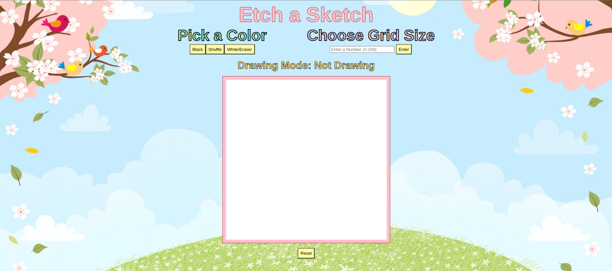

# Etch-a-Sketch

Objective:

Etch-a-Sketch Game 
I am creating an etch-a-sketch game while moving through The Odin Project curriculum. I am combining what I've learned in html, css, and javascript.

Completed Game Images:

Background Image: dreamstime (Royalty-Free Stock Photo)

Features on Page:
1. Three Buttons for Color Changes
2. Textbox for GridSquare Selection
3. Grid to Drawn On
4. Reset Button to Refresh Page

