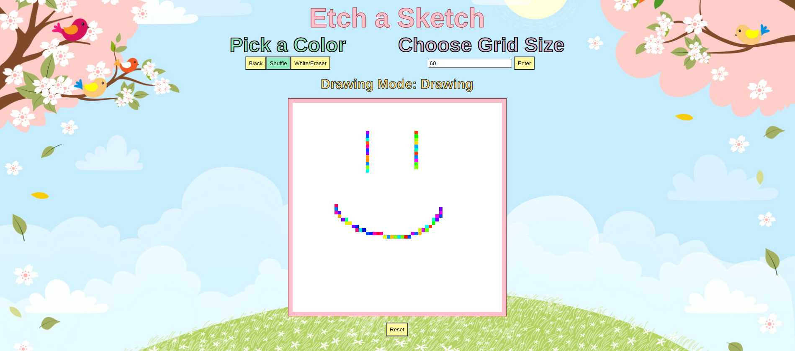

# Etch-a-Sketch

**Objective**

I am creating an Etch-a-Sketch game to combine some of the skills I've learned in HTML, CSS, and JavaScript.

Completed Game Images:

***Features on Page***

1. The three color buttons show the user what color is in use after a user selection is made.
2. The textbox for grid square selection allows the user to choose the size for the grid squares using a hidden area expression (l*w). The user enters one number that is used for both length and width measurements.
3. The grid has a click "on" or "off" functionality so the user is not constantly drawing as soon as they reach the grid. The mode for "Drawing" or "Not Drawing" is shown above the grid for easy visibility.
4. The reset button refreshes the page so the user will not have to change their previous drawing selections before beginning a fresh drawing.  

***Credits***

Background Image: dreamstime (Royalty-Free Stock Photo)

